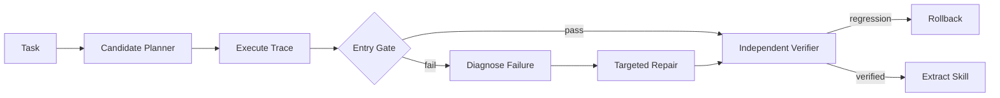

# Reflective Agent Lab

A test-time-scaling harness that turns blind resampling into gated diagnosis, targeted repair, independent verification, rollback, and reusable skill extraction.

This repository implements an original, laptop-scale reference system for a
production problem that repeatedly appears in strong AI/ML/software-engineering
portfolios. It focuses on architecture, failure handling, evaluation, and
reproducibility instead of claiming access to proprietary infrastructure.

## What is implemented

- Symbolic tool environment with explicit preconditions and side effects
- Entry gate that reflects only on failed candidates
- Failure taxonomy for observation, tool, ordering, and verification gaps
- Targeted trajectory repair with rollback when verification regresses
- Skill library learned only from verified successful traces

## Architecture



## Quick start

```bash
python -m venv .venv
source .venv/bin/activate
python -m pip install -e .
python -m unittest discover -s tests -v
PYTHONPATH=src python src/reflective_agent_lab/core.py
```

The demo prints a self-contained JSON report from seeded synthetic fixtures;
wall-clock latency values are machine-dependent. It is safe to run offline and
does not require credentials, paid APIs, GPUs, or employer data.

## Evaluation contract

The benchmark reports baseline pass rate, repaired pass rate, rollback count, mean tool calls, and success by failure category. Fixtures are symbolic so every verdict can be independently reproduced.

## Repository layout

- `src/reflective_agent_lab/core.py` - executable reference implementation
- `tests/test_core.py` - deterministic regression and failure-path tests
- `benchmark-report.json` - checked-in output from the deterministic demo
- `.github/workflows/ci.yml` - clean-install CI on Python 3.12

## Scope and provenance

The problem definition was inspired by recurring engineering patterns observed
while reviewing a large resume corpus. All naming, source code, fixtures, and
documentation in this repository are original. Reported demo numbers are local
synthetic measurements, not production claims. The system is intentionally
compact so reviewers can inspect every design decision.

## License

MIT
