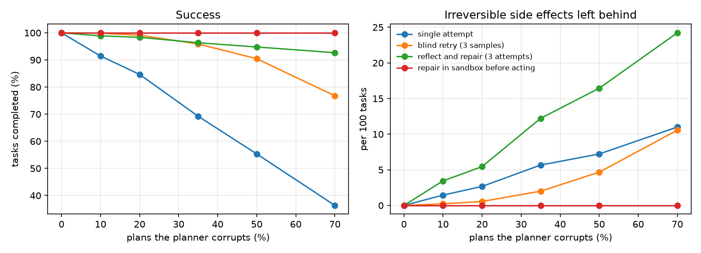
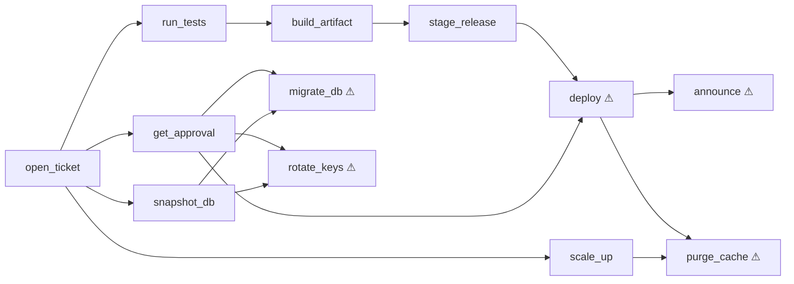

# Reflective Agent Lab

[](https://github.com/asher0913/reflective-agent-lab/actions/workflows/ci.yml)


[](LICENSE)

What should a tool-using agent do when its planner is wrong, and some of its tools cannot be
undone? This lab compares five strategies (one shot, blind resampling, reflect-and-repair,
repair inside a sandbox before touching the real system, and sandbox repair plus a library of
verified skills) on a release-engineering tool world with irreversible actions, a planner that
corrupts a controlled share of its plans, and a tool that is retired half-way through the run.

The measures are the ones an operator cares about: tasks completed, real tool calls, **planner
calls** (the expensive model calls), and **irreversible side effects left behind** by attempts
that failed or went beyond the task.



## Results

500 tasks drawn from 8 goals (deploy, migrate, rotate keys, announce, purge cache and
combinations); the planner corrupts 35% of its plans; `deploy` is retired after task 250 in
favour of `deploy_v2`, which also needs a canary run. Mean of 5 seeds; every strategy sees
identical planner draws.

| Strategy | Success | First 50 after drift | Tool calls / success | Planner calls / task | Side effects / 100 tasks |
|---|---:|---:|---:|---:|---:|
| single attempt | 68.2% | 68.4% | 9.07 | 1.32 | 5.6 |
| blind retry (3 samples) | 96.6% | 94.8% | 8.81 | 1.45 | 2.1 |
| reflect and repair (3 attempts) | 94.7% | 92.4% | 9.31 | 1.00 | **12.0** |
| repair in sandbox before acting | **100%** | **100%** | **7.22** | 1.00 | **0.2** |
| sandbox repair + verified skills | **100%** | **100%** | **7.16** | **0.03** | **0.2** |

- **Reflecting on the live system is the most dangerous option.** Repairing from real error
  messages is better than resampling on dropped and swapped steps (100% vs 91%), but every
  diagnosis costs a real failed attempt, and half-finished attempts leave migrations and
  deployments behind. It also "repairs" an unrequested irreversible action by adding its missing
  preconditions, which makes it executable. Side effects: 12 per 100 tasks, 6× blind retry.
- **Verify before acting.** Running the same diagnose-and-patch loop against the agent's own model
  of the tools, then executing only a plan that reaches the goal in simulation, completes every
  task with fewer real calls. A scope gate drops irreversible actions the goal does not need.
- **Skills remove the planner from the loop.** Reusing a verified plan for a goal seen before cuts
  planner calls from 1.00 to 0.03 per task. Skills are keyed by the tool catalogue version and
  dropped when a retirement notice arrives, so none survives the drift.
- **Drift costs one mistake.** The first task after `deploy` is retired fails in the real system
  (the sandbox still believes in `deploy`), leaves one irreversible change behind, and triggers a
  catalogue refresh; the 0.2 side effects per 100 tasks are exactly that.

### Verification is only as good as the model

The sandbox results above assume the agent's model of the tools is exact. To measure what happens
when it is not, the agent starts from a copy of the catalogue with some true preconditions
removed, and learns each one the first time the real system reports it:

| Missing preconditions | Success | Side effects / 100 tasks | Learned | Side effects in tasks 1–50 | … in tasks 51–500 |
|---:|---:|---:|---:|---:|---:|
| 0 | 100% | 0.00 | 0 | 0 | 0 |
| 1 | 100% | 0.04 | 1.0 | 0.2 | 0 |
| 2 | 100% | 0.04 | 1.8 | 0.2 | 0 |
| 4 | 99.96% | 0.08 | 3.4 | 0.4 | 0 |
| 6 | 99.88% | 0.12 | 5.4 | 0.6 | 0 |

Every model gap is paid for with real failed attempts early in the stream, and the damage stops
once the gap is learned. Gaps that are never exercised by the task mix are never learned (5.4 of 6),
which is harmless here but means a model can look complete while it is not.

## The world



⚠ marks irreversible tools. After task 250, `deploy` is replaced by `deploy_v2`, which also
requires `run_canary`. The planner is a stand-in for an LLM: it produces the correct plan and then,
with the configured probability, applies one realistic corruption: dropping a step, swapping two
dependent steps, naming a plausible tool that does not exist (`deploy_service`, `db_migrate`), or
inserting an irreversible action nobody asked for.

## Usage

```bash
pip install -e '.[dev]'

reflect-lab compare                    # the main table (about 1 s)
reflect-lab report --out results       # strategies, error-rate sweep, model fidelity
python scripts/make_figures.py         # needs matplotlib
```

## Tests

`pytest -q` runs 14 tests: every goal is reachable in both catalogue versions, irreversible facts
survive rollback, retired tools say so, each corruption type breaks a plan or widens its scope,
the scope gate removes unrequested irreversible actions, repair moves a late producer forward,
skills are reused and invalidated by drift, a degraded model is learned back, the headline
ordering holds, and the fidelity experiment runs.

## Limitations

- The planner's errors are injected, one per corrupted plan, with a fixed taxonomy. A real LLM
  makes correlated and compound errors, and its repairs are not deterministic.
- Each fact has a single producer, so planning is backward chaining. Worlds with alternative
  producers need search, and "verify in a sandbox" then competes with planning cost.
- The sandbox is the agent's own symbolic model. For real systems it would be a dry-run API, a
  staging environment or a policy engine, each with its own fidelity gaps.

## License

MIT
